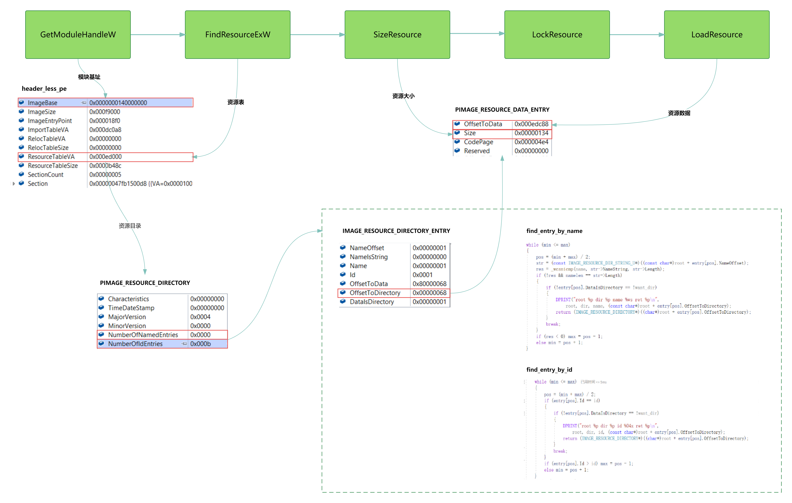
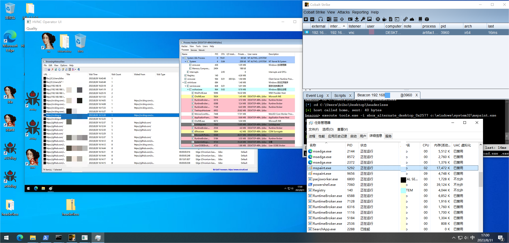

# HeaderLessPE
## Introduction ([中文](/README_zh.md))
Extends ICEDID using in-memory PE loading technology, allowing it to run a GUI program without a file.  
Compared to other in-memory loading techniques like MemDll, the extended HeaderLessPE has two advantages:  
- **Avoids the traditional DOS and PE headers IOC**
The DOS header and PE header are often focal points for memory scanning, requiring the use of a Profile file to erase the loaded Beacon header when using Cobalt Strike. With HeaderLessPE, you don't need to worry about this issue.  
- **Supports relocation and import tables, making it easy to convert EXEs into HeaderLessPE structures**
As long as it supports relocation and does not include structures such as Tls and delay import, it can be converted into HeaderLessPE. This can be used not only for creating Trojan memory modules but also for conveniently converting some hacking tools into HeaderLessPE for in-memory loading and execution, expanding the available attack tools.  
  

  
## TEST
tools.exe -i "desktop_name" c:\windows\system32\mspaint.exe loader.exe ADExplorer64.exe

This will run the ADExplorer64 tool without a file on the desktop_name desktop.

Article Link：

## Reference 
1. https://github.com/strivexjun/MemoryModulePP.git
2. https://doxygen.reactos.org
3. https://github.com/hasherezade/pe-sieve.git
4. https://bbs.kanxue.com/thread-264956.htm

